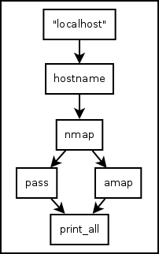

.. _quickstart:

Quickstart
==========

Eager to get started? This page gives a good introduction to `Hackersh <http://www.hackersh.org>`_. It assumes that:

- You already have Hackersh installed. If you do not, head over to the :ref:`installation` section.
- You are familiar with `Pythonect <http://www.pythonect.org>`_. If you aren't, head over to the `Pythonect Tutorial <http://docs.pythonect.org/en/latest/tutorial/index.html>`_

---------------
Using the Shell
---------------

Once Hackersh is :ref:`installed <installation>`, you can run it from the command-line like this: ::

	$ hackersh
	Hackersh Version 0.3.0
	Copyright (C) 2013 Itzik Kotler
	Visit http://www.hackersh.org for updates.

	********************************************************************************
	*                                                                              *
	*                                                                              *
	*  Welcome to Hacker Shell Version 0.3.0                                       *
	*                                                                              *
	*                                                                              *
	********************************************************************************

	>

Typing ``help`` or ``?`` once in the Hackersh shell prompt will list the
commands available to you. ::

	> help

	Shell Builtin Commands
	======================

	    Command        Description
	    -------        -----------
	    ?              Display information about builtin commands
	    exit           Exit the shell
	    help           Display information about builtin commands
	    info           Queries the supplied component or components for information
	    quit           Exit the shell
	    show           Displays components

Type ``help X`` to find out more about the command ``X``. ::

	> help show
	Usage: show [all|internal|external|root]

Or pass the command-line option ``-h`` or ``--help`` to the command: ::

	> show -h
	Usage: show [all|internal|external|root]

When running interactively (i.e. when commands are read from a tty), Hackersh will employs the GNU readline library to provide some useful command line editing facilities, as well as to save command history. Pressing :kbd:`Tab` will autocomplete commands, components, directories, files, and more. ::

	> info ipv4_
	ipv4_address  ipv4_range

Pressing :kbd:`Up` and :kbd:`Down` will navigate through all the history commands entered at the prompt.

The command history is saved in the :file:`.hackersh_history` file in your home directory between different invocations of the shell.

----------------
Running Commands
----------------

Hackersh runs commands like other shells: ::

	> /bin/ping -c 3 192.168.1.110

	PING 192.168.1.110 (192.168.1.110) 56(84) bytes of data.
	64 bytes from 192.168.1.110: icmp_req=1 ttl=64 time=0.224 ms
	64 bytes from 192.168.1.110: icmp_req=2 ttl=64 time=0.064 ms
	64 bytes from 192.168.1.110: icmp_req=3 ttl=64 time=0.449 ms

	--- 192.168.1.110 ping statistics ---
	3 packets transmitted, 3 received, 0% packet loss, time 1998ms
	rtt min/avg/max/mdev = 0.064/0.245/0.449/0.158 ms

	> /usr/bin/nmap 192.168.1.110 -p 80

	Starting Nmap 6.25 ( http://nmap.org ) at 2013-09-22 17:08 IDT
	Nmap scan report for 192.168.1.110
	Host is up (0.00026s latency).
	PORT   STATE SERVICE
	80/tcp open  http
	MAC Address: 08:00:27:AD:A8:E7 (Cadmus Computer Systems)

	Nmap done: 1 IP address (1 host up) scanned in 0.07 seconds

	> /usr/bin/nikto -host 192.168.1.110 -port 80

	- Nikto v2.1.4
	---------------------------------------------------------------------------
	+ Target IP:          192.168.1.110
	+ Target Hostname:    192.168.1.110
	+ Target Port:        80
	+ Start Time:         2013-09-23 17:09:46
	---------------------------------------------------------------------------
	+ Server: Apache/2.2.16 (Debian)
	+ Retrieved x-powered-by header: PHP/5.3.3-7+squeeze15
	+ Apache/2.2.16 appears to be outdated (current is at least Apache/2.2.17). Apache 1.3.42 (final release) and 2.0.64 are also current.
	+ DEBUG HTTP verb may show server debugging information. See http://msdn.microsoft.com/en-us/library/e8z01xdh%28VS.80%29.aspx for details.
	+ OSVDB-12184: /index.php?=PHPB8B5F2A0-3C92-11d3-A3A9-4C7B08C10000: PHP reveals potentially sensitive information via certain HTTP requests that contain specific QUERY strings.
	+ OSVDB-3268: /files/: Directory indexing found.
	+ OSVDB-3092: /files/: This might be interesting...
	+ OSVDB-3268: /img/: Directory indexing found.
	+ OSVDB-3092: /img/: This might be interesting...
	+ OSVDB-3268: /icons/: Directory indexing found.
	+ OSVDB-3233: /icons/README: Apache default file found.
	+ 6448 items checked: 0 error(s) and 10 item(s) reported on remote host
	+ End Time:           2013-09-23 17:09:55 (9 seconds)
	---------------------------------------------------------------------------
	+ 1 host(s) tested

If a command starts with ``/`` (slash), ``./`` (dot slash), or ``../`` (dot dot slash) it is executed as a system command.

------------------
Running Components
------------------

Hackersh comes with a library of components for security testing. The
components are like building blocks. They offer various assemblies with their
parts being interchangeable.

Hackersh runs (and pipes) components like commands: you type a component name,
followed by its arguments. ::

	> "192.168.1.110" | ipv4_address | nmap -p 80 | nikto

	Properties:
	-----------

	+--------------+---------------+
	| Property     | Value         |
	+--------------+---------------+
	| Ipv4_Address | 192.168.1.110 |
	+--------------+---------------+
	| Name         | 192.168.1.110 |
	+--------------+---------------+
	| Service      | HTTP          |
	+--------------+---------------+
	| Proto        | TCP           |
	+--------------+---------------+
	| Port         | 80            |
	+--------------+---------------+

	Graph:
	------

	192.168.1.110 <via str>
	`-192.168.1.110 <via ipv4_address>
	  `-80/tcp (HTTP) <via nmap -p 80>
	    `-Found #10 Vulnerabilities <via nikto>

	Vulnerabilities:
	----------------

	+------------------------------------------------------------------------------------------+----------------------------------------------------------------------------+
	| VULNERABILITY DESCRIPTION                                                                | URL                                                                        |
	+------------------------------------------------------------------------------------------+----------------------------------------------------------------------------+
	| Retrieved x-powered-by header: PHP/5.3.3-7+squeeze15                                     | http://192.168.1.110:80/                                                   |
	+------------------------------------------------------------------------------------------+----------------------------------------------------------------------------+
	| Apache/2.2.16 appears to be outdated (current is at least Apache/2.2.17). Apache 1.3.42  | http://192.168.1.110:80/                                                   |
	| (final release) and 2.0.64 are also current.                                             |                                                                            |
	+------------------------------------------------------------------------------------------+----------------------------------------------------------------------------+
	| DEBUG HTTP verb may show server debugging information. See http://msdn.microsoft.com/en- | http://192.168.1.110:80/                                                   |
	| us/library/e8z01xdh%28VS.80%29.aspx for details.                                         |                                                                            |
	+------------------------------------------------------------------------------------------+----------------------------------------------------------------------------+
	| /index.php?=PHPB8B5F2A0-3C92-11d3-A3A9-4C7B08C10000: PHP reveals potentially sensitive   | http://192.168.1.110:80/index.php?=PHPB8B5F2A0-3C92-11d3-A3A9-4C7B08C10000 |
	| information via certain HTTP requests that contain specific QUERY strings.               |                                                                            |
	+------------------------------------------------------------------------------------------+----------------------------------------------------------------------------+
	| /files/: Directory indexing found.                                                       | http://192.168.1.110:80/files/                                             |
	+------------------------------------------------------------------------------------------+----------------------------------------------------------------------------+
	| /files/: This might be interesting...                                                    | http://192.168.1.110:80/files/                                             |
	+------------------------------------------------------------------------------------------+----------------------------------------------------------------------------+
	| /img/: Directory indexing found.                                                         | http://192.168.1.110:80/img/                                               |
	+------------------------------------------------------------------------------------------+----------------------------------------------------------------------------+
	| /img/: This might be interesting...                                                      | http://192.168.1.110:80/img/                                               |
	+------------------------------------------------------------------------------------------+----------------------------------------------------------------------------+
	| /icons/: Directory indexing found.                                                       | http://192.168.1.110:80/icons/                                             |
	+------------------------------------------------------------------------------------------+----------------------------------------------------------------------------+
	| /icons/README: Apache default file found.                                                | http://192.168.1.110:80/icons/README                                       |
	+------------------------------------------------------------------------------------------+----------------------------------------------------------------------------+

You can mix between Hackersh components and any third-party binaries (e.g.
cat, grep, and etc.) as long as the binaries output (via stdout) something
meaningful: ::

	> /bin/cat /etc/hosts | /bin/grep "127.0.0.1" | /usr/bin/awk '{ print $1 }' | /usr/bin/tr -d '\n' | ipv4_address | nmap

	127.0.0.1 <via str>
	`-127.0.0.1 <via ipv4_address>
	  +-80/tcp (HTTP) <via nmap_result_#1>
	  `-22/tcp (SSH) <via nmap_result_#0>

------------
Getting Help
------------

To get help on a specific component, use the built-in ``info`` command: ::

	> info ipv4_address
	Component: ipv4_address
	Version: 0.1.0
	Source: /usr/local/lib/python2.7/dist-packages/Hackersh-0.3.dev0-py2.7.egg/hackersh/components/internal/ipv4_address.pyc
	Type: RootComponent
	Provided by: Itzik Kotler <xorninja@gmail.com>
	Filter: None
	Query: None
	Description:
	   Convert String to IPv4 Address

To get a specific component usage, pass the command-line ``-h`` or ``--help`` to it: ::

	> nmap -h
	...
	...
	...

Don't worry if the application don't take ``-h`` or ``--help`` options.
Hackersh will automatically map it to the correct command line option.

---------
Debugging
---------

Hackersh offers two debugging options: Shell Debugging and Component
Debugging. These options can be enabled together, or enabled separately.

To debug the shell simply pass the command line option ``-v`` to increment the
verbosity: ::

	$ hackersh -vvv

To debug a specific Hackersh component, just pass: ``debug=True`` to it and see what
the input and output strings are: ::

	> "127.0.0.1" | ipv4_address | nmap('-p 80', debug=True) | nikto

-------------
Return Values
-------------

Most Hackersh components take and output Context. Context is a directed
graph where each node is a dictionary. The node dictionary contains key/value
pairs that contain the properties of a single component execution result. Each
node points to its `successor`, which is another properties dictionary of
another single component result that is waiting on it to complete.

Hackersh starts with an empty Context and after a successful execution it
will assign the result of the last returned Context to the ``_`` (underscore)
variable. In other words: ::

	> "192.168.1.110"

	192.168.1.110

	> _ | ipv4_address

	Properties:
	-----------

	+--------------+---------------+
	| Property     | Value         |
	+--------------+---------------+
	| Ipv4_Address | 192.168.1.110 |
	+--------------+---------------+
	| Name         | 192.168.1.110 |
	+--------------+---------------+

	Graph:
	------

	192.168.1.110 <via str>
	`-192.168.1.110 <via ipv4_address>

	> _ | nmap

	192.168.1.110 <via str>
	`-192.168.1.110 <via ipv4_address>
	  +-80/tcp (HTTP) <via nmap_result_#1>
	  +-22/tcp (SSH) <via nmap_result_#0>
	  `-389/tcp (LDAP) <via nmap_result_#2>

	> _ | nikto

	Properties:
	-----------

	+--------------+---------------+
	| Property     | Value         |
	+--------------+---------------+
	| Ipv4_Address | 192.168.1.110 |
	+--------------+---------------+
	| Name         | 192.168.1.110 |
	+--------------+---------------+
	| Service      | HTTP          |
	+--------------+---------------+
	| Proto        | TCP           |
	+--------------+---------------+
	| Port         | 80            |
	+--------------+---------------+

	Graph:
	------

	192.168.1.110 <via str>
	`-192.168.1.110 <via ipv4_address>
	  `-80/tcp (HTTP) <via nmap_result_#1>
	    `-Found #10 Vulnerabilities <via nikto>

	Vulnerabilities:
	----------------

	+------------------------------------------------------------------------------------------+----------------------------------------------------------------------------+
	| VULNERABILITY DESCRIPTION                                                                | URL                                                                        |
	+------------------------------------------------------------------------------------------+----------------------------------------------------------------------------+
	| Retrieved x-powered-by header: PHP/5.3.3-7+squeeze15                                     | http://192.168.1.110:80/                                                   |
	+------------------------------------------------------------------------------------------+----------------------------------------------------------------------------+
	| Apache/2.2.16 appears to be outdated (current is at least Apache/2.2.17). Apache 1.3.42  | http://192.168.1.110:80/                                                   |
	| (final release) and 2.0.64 are also current.                                             |                                                                            |
	+------------------------------------------------------------------------------------------+----------------------------------------------------------------------------+
	| DEBUG HTTP verb may show server debugging information. See http://msdn.microsoft.com/en- | http://192.168.1.110:80/                                                   |
	| us/library/e8z01xdh%28VS.80%29.aspx for details.                                         |                                                                            |
	+------------------------------------------------------------------------------------------+----------------------------------------------------------------------------+
	| /index.php?=PHPB8B5F2A0-3C92-11d3-A3A9-4C7B08C10000: PHP reveals potentially sensitive   | http://192.168.1.110:80/index.php?=PHPB8B5F2A0-3C92-11d3-A3A9-4C7B08C10000 |
	| information via certain HTTP requests that contain specific QUERY strings.               |                                                                            |
	+------------------------------------------------------------------------------------------+----------------------------------------------------------------------------+
	| /files/: Directory indexing found.                                                       | http://192.168.1.110:80/files/                                             |
	+------------------------------------------------------------------------------------------+----------------------------------------------------------------------------+
	| /files/: This might be interesting...                                                    | http://192.168.1.110:80/files/                                             |
	+------------------------------------------------------------------------------------------+----------------------------------------------------------------------------+
	| /img/: Directory indexing found.                                                         | http://192.168.1.110:80/img/                                               |
	+------------------------------------------------------------------------------------------+----------------------------------------------------------------------------+
	| /img/: This might be interesting...                                                      | http://192.168.1.110:80/img/                                               |
	+------------------------------------------------------------------------------------------+----------------------------------------------------------------------------+
	| /icons/: Directory indexing found.                                                       | http://192.168.1.110:80/icons/                                             |
	+------------------------------------------------------------------------------------------+----------------------------------------------------------------------------+
	| /icons/README: Apache default file found.                                                | http://192.168.1.110:80/icons/README                                       |
	+------------------------------------------------------------------------------------------+----------------------------------------------------------------------------+

Is equal to: ::

	> "192.168.1.110" | ipv4_address | nmap | nikto

	Properties:
	-----------

	+--------------+---------------+
	| Property     | Value         |
	+--------------+---------------+
	| Ipv4_Address | 192.168.1.110 |
	+--------------+---------------+
	| Name         | 192.168.1.110 |
	+--------------+---------------+
	| Service      | HTTP          |
	+--------------+---------------+
	| Proto        | TCP           |
	+--------------+---------------+
	| Port         | 80            |
	+--------------+---------------+

	Graph:
	------

	192.168.1.110 <via str>
	`-192.168.1.110 <via ipv4_address>
	  `-80/tcp (HTTP) <via nmap_result_#1>
	    `-Found #10 Vulnerabilities <via nikto>

	Vulnerabilities:
	----------------

	+------------------------------------------------------------------------------------------+----------------------------------------------------------------------------+
	| VULNERABILITY DESCRIPTION                                                                | URL                                                                        |
	+------------------------------------------------------------------------------------------+----------------------------------------------------------------------------+
	| Retrieved x-powered-by header: PHP/5.3.3-7+squeeze15                                     | http://192.168.1.110:80/                                                   |
	+------------------------------------------------------------------------------------------+----------------------------------------------------------------------------+
	| Apache/2.2.16 appears to be outdated (current is at least Apache/2.2.17). Apache 1.3.42  | http://192.168.1.110:80/                                                   |
	| (final release) and 2.0.64 are also current.                                             |                                                                            |
	+------------------------------------------------------------------------------------------+----------------------------------------------------------------------------+
	| DEBUG HTTP verb may show server debugging information. See http://msdn.microsoft.com/en- | http://192.168.1.110:80/                                                   |
	| us/library/e8z01xdh%28VS.80%29.aspx for details.                                         |                                                                            |
	+------------------------------------------------------------------------------------------+----------------------------------------------------------------------------+
	| /index.php?=PHPB8B5F2A0-3C92-11d3-A3A9-4C7B08C10000: PHP reveals potentially sensitive   | http://192.168.1.110:80/index.php?=PHPB8B5F2A0-3C92-11d3-A3A9-4C7B08C10000 |
	| information via certain HTTP requests that contain specific QUERY strings.               |                                                                            |
	+------------------------------------------------------------------------------------------+----------------------------------------------------------------------------+
	| /files/: Directory indexing found.                                                       | http://192.168.1.110:80/files/                                             |
	+------------------------------------------------------------------------------------------+----------------------------------------------------------------------------+
	| /files/: This might be interesting...                                                    | http://192.168.1.110:80/files/                                             |
	+------------------------------------------------------------------------------------------+----------------------------------------------------------------------------+
	| /img/: Directory indexing found.                                                         | http://192.168.1.110:80/img/                                               |
	+------------------------------------------------------------------------------------------+----------------------------------------------------------------------------+
	| /img/: This might be interesting...                                                      | http://192.168.1.110:80/img/                                               |
	+------------------------------------------------------------------------------------------+----------------------------------------------------------------------------+
	| /icons/: Directory indexing found.                                                       | http://192.168.1.110:80/icons/                                             |
	+------------------------------------------------------------------------------------------+----------------------------------------------------------------------------+
	| /icons/README: Apache default file found.                                                | http://192.168.1.110:80/icons/README                                       |
	+------------------------------------------------------------------------------------------+----------------------------------------------------------------------------+

.. _condexprs:

-----------------------
Conditional Expressions
-----------------------

Hackersh follows the `Pythonect Control Flow Tools <http://docs.pythonect.org/en/latest/tutorial/controlflow.html>`_ concept, and you can use the Context key/value pairs in a conditional expression: ::

	> "192.168.1.110" | ipv4_address | nmap | _['PORT'] == '80'

	Properties:
	-----------

	+--------------+---------------+
	| Property     | Value         |
	+--------------+---------------+
	| Ipv4_Address | 192.168.1.110 |
	+--------------+---------------+
	| Proto        | TCP           |
	+--------------+---------------+
	| Name         | 192.168.1.110 |
	+--------------+---------------+
	| Service      | HTTP          |
	+--------------+---------------+
	| Port         | 80            |
	+--------------+---------------+

	Graph:
	------

	192.168.1.110 <via str>
	`-192.168.1.110 <via ipv4_address>
	  `-80/tcp (HTTP) <via nmap_result_#1>

The expression may contain any number of Python Boolean Operations: ::

	> "192.168.1.110" | ipv4_address | nmap | _['PORT'] == '8080' or _['SERVICE'] == 'HTTP'

	Properties:
	-----------

	+--------------+---------------+
	| Property     | Value         |
	+--------------+---------------+
	| Ipv4_Address | 192.168.1.110 |
	+--------------+---------------+
	| Proto        | TCP           |
	+--------------+---------------+
	| Name         | 192.168.1.110 |
	+--------------+---------------+
	| Service      | HTTP          |
	+--------------+---------------+
	| Port         | 80            |
	+--------------+---------------+

	Graph:
	------

	192.168.1.110 <via str>
	`-192.168.1.110 <via ipv4_address>
	`-80/tcp (HTTP) <via nmap_result_#1>

As well as Python functions: ::

	> "192.168.1.110" | ipv4_address | nmap | int(_['PORT']) < 1024

	192.168.1.110 <via str>
	`-192.168.1.110 <via ipv4_address>
	  +-80/tcp (HTTP) <via nmap_result_#1>
	  +-22/tcp (SSH) <via nmap_result_#0>
	  `-389/tcp (LDAP) <via nmap_result_#2>

-----------------------
Map, Reduce, and Filter
-----------------------

Hackersh uses Pythonect's automatic parallelization feature. Whenever a
Hackersh component returns more than one context, it would automatically
map each Context to it's own thread.

Most Hackersh components are one-to-one or one-to-many. For example the
``print`` component is one-to-one. It will print the current context on the
flow: ::

	> "192.168.1.110" | ipv4_address | nmap | print
	Properties:
	-----------

	+--------------+---------------+
	| Property     | Value         |
	+--------------+---------------+
	| Ipv4_Address | 192.168.1.110 |
	+--------------+---------------+
	| Proto        | TCP           |
	+--------------+---------------+
	| Name         | 192.168.1.110 |
	+--------------+---------------+
	| Service      | SSH           |
	+--------------+---------------+
	| Port         | 22            |
	+--------------+---------------+

	Graph:
	------

	192.168.1.110 <via str>
	`-192.168.1.110 <via ipv4_address>
	  `-22/tcp (SSH) <via nmap_result_#0>

	Properties:
	-----------

	+--------------+---------------+
	| Property     | Value         |
	+--------------+---------------+
	| Ipv4_Address | 192.168.1.110 |
	+--------------+---------------+
	| Proto        | TCP           |
	+--------------+---------------+
	| Name         | 192.168.1.110 |
	+--------------+---------------+
	| Service      | HTTP          |
	+--------------+---------------+
	| Port         | 80            |
	+--------------+---------------+

	Graph:
	------

	192.168.1.110 <via str>
	`-192.168.1.110 <via ipv4_address>
	  `-80/tcp (HTTP) <via nmap_result_#1>

	Properties:
	-----------

	+--------------+---------------+
	| Property     | Value         |
	+--------------+---------------+
	| Ipv4_Address | 192.168.1.110 |
	+--------------+---------------+
	| Proto        | TCP           |
	+--------------+---------------+
	| Name         | 192.168.1.110 |
	+--------------+---------------+
	| Service      | LDAP          |
	+--------------+---------------+
	| Port         | 389           |
	+--------------+---------------+

	Graph:
	------

	192.168.1.110 <via str>
	`-192.168.1.110 <via ipv4_address>
	  `-389/tcp (LDAP) <via nmap_result_#2>

Some Hackersh components are many-to-one. They will always end with ``_all``
postfix. For example the ``print_all`` component is many-to-one. It will
reduce all contexts to one context and print it: ::

	> "192.168.1.110" | ipv4_address | nmap | print_all

	192.168.1.110 <via str>
	`-192.168.1.110 <via ipv4_address>
	  +-80/tcp (HTTP) <via nmap_result_#1>
	  +-22/tcp (SSH) <via nmap_result_#0>
	  `-389/tcp (LDAP) <via nmap_result_#2>

.. note::

	When running Hackersh interactively (i.e. when commands are read from a tty) it will automatically reduce all the contexts and print the reduced context result.

To filter a reduced context you can use the ``/`` (div, forward slash) operator and a boolean expression (like :ref:`Conditional Expressions <condexprs>`): ::

	> _/"SERVICE == 'HTTP' or SERVICE == 'HTTPS'"

	Properties:
	-----------

	+--------------+---------------+
	| Property     | Value         |
	+--------------+---------------+
	| Port         | 80            |
	+--------------+---------------+
	| Ipv4_Address | 192.168.1.110 |
	+--------------+---------------+
	| Name         | 192.168.1.110 |
	+--------------+---------------+
	| Service      | HTTP          |
	+--------------+---------------+
	| Proto        | TCP           |
	+--------------+---------------+

	Graph:
	------

	192.168.1.110 <via str>
	`-192.168.1.110 <via ipv4_address>
	  `-80/tcp (HTTP) <via nmap_result_#1>

Or: ::

	> _/"PORT == '80' and PROTO == 'TCP'"

	Properties:
	-----------

	+--------------+---------------+
	| Property     | Value         |
	+--------------+---------------+
	| Port         | 80            |
	+--------------+---------------+
	| Ipv4_Address | 192.168.1.110 |
	+--------------+---------------+
	| Name         | 192.168.1.110 |
	+--------------+---------------+
	| Service      | HTTP          |
	+--------------+---------------+
	| Proto        | TCP           |
	+--------------+---------------+

	Graph:
	------

	192.168.1.110 <via str>
	`-192.168.1.110 <via ipv4_address>
	  `-80/tcp (HTTP) <via nmap_result_#1>

.. note::

	As oppose to :ref:`Conditional Expressions <condexprs>`. This Query Language doesn't require ``_[]`` around context key names

-------------------------------
Importing and Exporting Context
-------------------------------

Hackersh lets you export and import your work at any time. You can use the
``write`` component to save a given context (or ``write_all`` to save all
contexts) into file: ::

	> "192.168.1.110" | ipv4_address | nmap | nikto | write 'web.json'

Reading it back is as easy as this: ::

	> read 'web.json' | print_all

The file format is determined by the extension you use in the file name (i.e.,
.json for a JSON file). Type ``info read`` or ``info write`` to see a complete
list of supported file formats.

---------------------------
Writing and Running Scripts
---------------------------

Hackerh uses Pythonect as it's scripting engine. Pythonect provides both a
`visual programming language and a text-based scripting language
<http://docs.pythonect.org/en/latest/tutorial/helloworld.html>`_.

The visual programming language is based on the idea of a diagram with “boxes
and arrows”:

.. note::

	This is an export (PNG) of a diagram made in `Dia <https://wiki.gnome.org/Apps/Dia/>`_. It's not actually a Hackersh script. The script is the actual **.dia** file.

Running a diagram is as easy as: ::

	$ hackersh alternate_nmap_amap_scan.dia

The text-based scripting language (same syntax as used in the shell) aims to
combine the quick and intuitive feel of shell scripting, with the power of
Python. Open your favorite editor and type: ::

	"localhost" -> hostname -> nmap -> [pass, amap] -> print_all

Save it as :file:`alternate_nmap_amap_scan.hs` and run it as follows: ::

	$ hackersh alternate_nmap_amap_scan.hs

.. note::

	On BSD’ish Unix systems, Hackersh text-based scripts can be made directly executable, by putting the line (The #! must be the first two chars of the file): ::

		#! /usr/bin/env hackersh

	(assuming that Hackersh is on the user’s PATH) at the beginning of the text-based script and giving the file an executable mode.

For more examples (in both, visual and text flavors) see the `examples/ <https://github.com/ikotler/hackersh/tree/master/examples>`_ directory.
